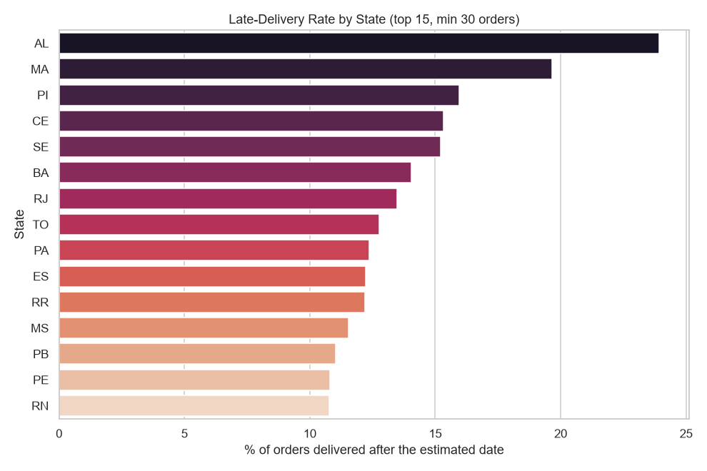
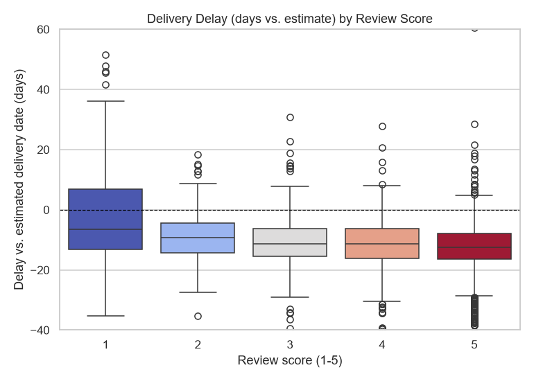
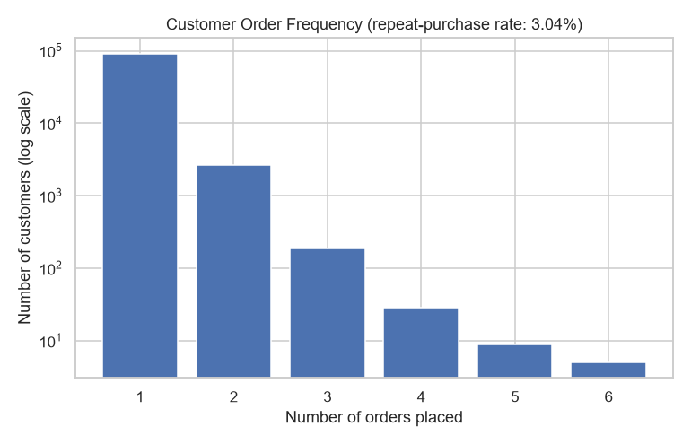

# Case Study: Turning Delivery Data into a Revenue-Protection Plan

**A merchant order-operations analysis for a WhatsApp-first SMB order platform, built on 99,441 real orders (2016–2018).**

---

## The business question

A platform that coordinates order-taking and delivery for small merchants lives or dies on one thing: does the order actually show up on time? Late deliveries are usually treated as a logistics footnote. This analysis asks a sharper question: **is delivery performance actually costing the business money, and if so, where should it intervene first?**

To answer that with real data rather than assumption, this project uses the [Olist Brazilian E-Commerce dataset](https://www.kaggle.com/datasets/olistbr/brazilian-ecommerce) — a real, anonymized record of orders, deliveries, payments and reviews from a platform that connects small merchants to marketplaces and coordinates fulfillment on their behalf. Structurally, it's the same problem: many small merchants, one shared delivery layer, and a platform trying to keep both merchants and end customers happy.

## Data & method

- **PostgreSQL** for the source of truth: a 9-table relational schema (orders, order items, payments, reviews, products, sellers, customers) with real foreign keys, queried with joins, CTEs, window functions and subqueries ([`sql/`](../sql)).
- **Python** (Pandas, NumPy, Matplotlib/Seaborn, SciPy) for cleaning, exploratory analysis, and statistical testing, run as a single reproducible script that regenerates every chart and number in this document ([`python/eda_analysis.py`](../python/eda_analysis.py)).
- **Excel** for translating the findings into a financial model a merchant-ops or finance stakeholder can actually manipulate ([`excel/financial_ops_model.xlsx`](../excel/financial_ops_model.xlsx)).
- **Power BI** for a live, explorable version of the same story ([`dashboard/order_ops_dashboard.pbix`](../dashboard/order_ops_dashboard.pbix)).

Every number below comes from a query or script in this repo — none of it is asserted without a source.

## Finding 1 — Delivery SLA failure is a *regional* problem, not a uniform one

Late-delivery rate ranges from **2.9%** in Rondônia to **23.9%** in Alagoas — an **8.3x gap** between the best- and worst-performing states. If this platform treated delivery SLA as a single company-wide number, it would look "fine" on average (~7% overall) while one region is failing nearly 1 in 4 deliveries.

**Why it matters:** a blanket policy ("tell all carriers to do better") wastes effort where nothing is wrong and under-reacts where something clearly is. The fix belongs at the region/carrier level, not the company level.

## Finding 2 — Delivery delay measurably destroys review scores

Pearson correlation between delivery delay (days late vs. the promised date) and review score: **r = -0.27** (p < 0.001, n = 96,359). A one-way ANOVA across the five review-score groups confirms the same pattern independently: **F = 1,979.6, p < 0.001**.

**Why it matters:** this turns "deliver on time" from an operations nice-to-have into a quantified satisfaction driver. Two independent statistical tests agree — this isn't noise.

## Finding 3 — Retention, not acquisition, is the real growth bottleneck

Of 94,990 unique customers, only **3.04%** ever placed a second order. For a platform whose whole pitch is an ongoing merchant-customer relationship (not a one-time marketplace transaction), a 97% single-order rate means almost the entire customer base is acquired once and never re-engaged.

**Why it matters:** every dollar spent on acquiring new customers is fighting a 97%-leaky bucket. A WhatsApp-native platform is unusually well positioned to fix this cheaply — a delivery-confirmation or reorder nudge is a message away, not a marketing campaign.

## Quantifying the impact: what does fixing SLA actually recover?

Rather than stop at "late deliveries are bad," the [Excel model](../excel/financial_ops_model.xlsx) turns Finding 1 into a dollar figure using a simple, transparent, adjustable formula:

> revenue at risk = (late orders) × (avg order value) × (est. repeat-purchase loss rate) × (avg customer lifetime orders)

With the platform's actual numbers (96,470 delivered orders, 8.1% late, R$159.83 average order value) and conservative assumptions (15% loss rate, 2.5 lifetime orders):

| Metric | Value |
|---|---|
| Orders that would need to move from "late" to "on-time" to hit a 5% SLA target | **3,003** |
| Revenue currently at risk from late deliveries | **≈ R$469,061** |
| Revenue recoverable by hitting the 5% target | **≈ R$179,959** |

These aren't hardcoded — they're live formulas. Change the assumed loss rate or target SLA in the yellow input cells and the whole model recalculates, which is the point: a stakeholder can stress-test the assumption instead of taking the number on faith.

## Recommendations

1. **Fix delivery SLA regionally, starting with the worst 15% of states** (SQL Q3/Q8 in [`sql/02_analysis_queries.sql`](../sql/02_analysis_queries.sql) already ranks them) — this is where the anomaly-detection query flags freight/carrier outliers worth a direct carrier-performance conversation.
2. **Treat delivery time as a satisfaction metric, not just a logistics one** — the statistical link (Finding 2) justifies putting delivery SLA on the same dashboard as review score, not a separate ops-only report.
3. **Redirect growth spend from acquisition to reactivation** — with a 97% single-order rate, a WhatsApp re-engagement flow triggered right after a successful delivery is likely higher-ROI than paid acquisition.

## Tools & skills demonstrated

SQL (PostgreSQL: joins, CTEs, window functions, subqueries) · Python (Pandas, NumPy, Matplotlib, Seaborn, SciPy) · Statistical testing (Pearson correlation, one-way ANOVA) · Excel (live formulas, what-if modeling) · Power BI (DAX measures, live database connection) · Data-quality auditing (documented, not silently patched)

Full technical report with all cleaning notes and additional cuts: [`reports/eda_report.md`](../reports/eda_report.md)
